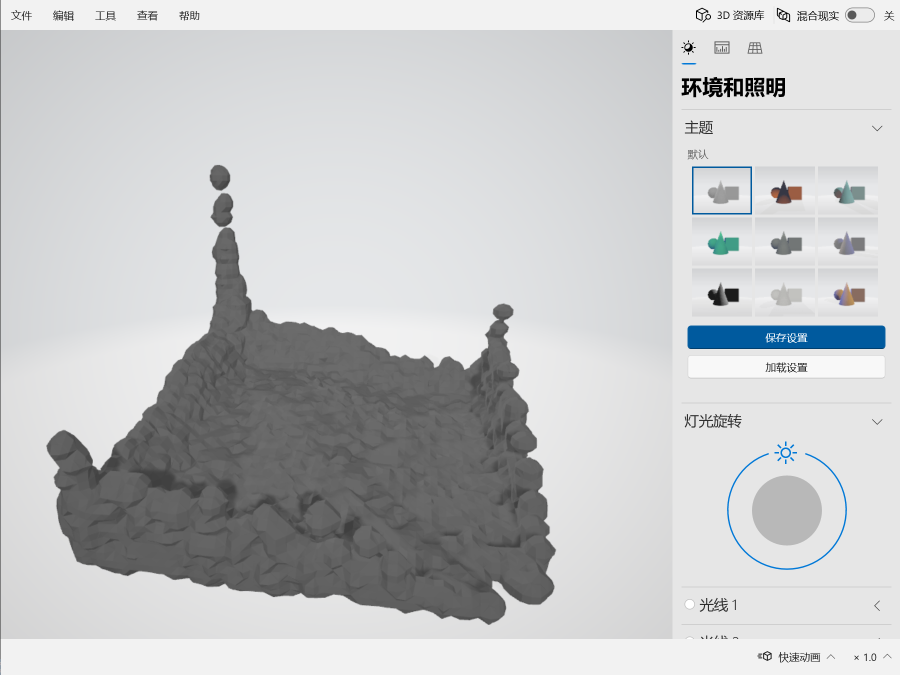

# 计算机动画原理与算法大作业 - 实验报告

【清华大学《计算机动画原理与算法》大作业】MPM fluid simulation and surface reconstruction using Taichi; A path tracer implemented by LuisaCompute python frontend.

# 运行环境与运行方法

## 流体模拟

流体模拟部分我使用的是python3.9。

需要安装各类库：

```bash
cd simulation
pip3.9 install -r requirements.txt
```

运行方式：

```bash
python3.9 mpm3d.py
```

修改python文件中的参数以指定输出路径：

```python
export_path = "results/" # 输出路径，若为空字符串则不输出
```

输出为每个时间步表面重建得到的obj文件。

## 离线渲染

使用python3.12，`LuisaCompute`的python前端实现。

需要安装各类库：

```bash
cd rendering
pip3.12 install -r requirements.txt
```

运行方式：

```bash
python3.12 path_tracer.py
```

修改python文件中的参数以指定读取obj路径以及输出路径：

```python
image_output_folder = 'results/'
obj_input_folder = '../simulation/results/'
```

输出的视频文件会在当前目录下。

# 算法思路

## 流体模拟MPM法

由于时间所限，我仅仅实现了各向同性插值以及marching cube法，因此流体表面看起来并不是很平整，也没有实现其他加分点，不得不说略有遗憾。

我参考了[taichi/tests/python/test_mpm88.py at master · taichi-dev/taichi (github.com)](https://github.com/taichi-dev/taichi/blob/master/tests/python/test_mpm88.py)进行实现。

**网格法**实际上在计算效率上有很明显的优势：不用插值就可以重构出空间连续场。然而，另一方面，**粒子法**能够精确地表示自由表面，描述边界的剧烈变形。

混合方法应运而生。实际上，混合方法解决的是上面所说的【如何用离散化的场描述Navier-Stokes方程】。

对于粒子法，我们自然可以用插值方法；但是，自然，也可以把粒子放到网格里面考虑，用粒子给网格赋予物理属性（压强、速度），之后就可以利用网格法去高效求解！

由于我们希望最终研究的仍然是粒子，因此再用更新后的网格去给粒子赋予物理属性（速度、变形），去更新粒子的速度和位置。（这里就不再需要受力分析了）

简单来说，其流程如下：

- 初始化
- 粒子到网格（P2G）
- 在网格上更新速度
- 网格到粒子（G2P）

MPM的关键优势在于其对复杂物质行为的高度适应性和数值稳定性，特别是在处理大的变形和破坏时。此外，通过在每个时间步结束时重置背景网格，它有效避免了传统方法中的数值耗散和网格纠缠问题，使其成为解决多物理和复杂材料行为问题的有力工具。

### 初始化

首先定义模拟参数：

```python
dim, n_grid, steps, dt = 3, 32, 25, 4e-4
```

这表示我们将会模拟一个三维场景，每个维度上划分32个网格，共模拟25步，时间步长为4e-4。

接着，我们关注每个粒子的共通信息：

```python
n_particles = n_grid**dim // 2 ** (dim - 1) # 粒子总数
dx = 1 / n_grid # 网格边长
p_rho = 1 # 粒子密度
p_vol = (dx * 0.5) ** 2 # 粒子体积（为啥不是3次方？）
p_mass = p_vol * p_rho # 粒子质量
gravity = 9.8 # 重力加速度
bound = 3 # 边界宽度
E = 400 # 弹性模量
```

mpm方法以粒子来离散化连续场，又用网格来重构出用于计算的场。因此，先定义对应字段：

```python
# 粒子信息
F_x = ti.Vector.field(dim, float, n_particles) # 位置
F_v = ti.Vector.field(dim, float, n_particles) # 速度
F_C = ti.Matrix.field(dim, dim, float, n_particles) # 形变梯度
F_J = ti.field(float, n_particles) # 体积变化（Jacobian）
# 网格信息
F_grid_v = ti.Vector.field(dim, float, (n_grid,) * dim) # 速度
F_grid_m = ti.field(float, (n_grid,) * dim) # 质量
```

在计算的时候，我们考虑3x3x3的邻域：

```python
neighbour = (3,) * dim
```

### 主循环

进入程序之后，执行`main()`：

```python
@ti.kernel
def init(): # 初始化粒子位置和体积变化值
    for i in range(n_particles):
        F_x[i] = ti.Vector([ti.random() for i in range(dim)]) * 0.4 + 0.15
        F_J[i] = 1

def T(a):
    if dim == 2:
        return a

    phi, theta = np.radians(28), np.radians(32)

    a = a - 0.5
    x, y, z = a[:, 0], a[:, 1], a[:, 2]
    cp, sp = np.cos(phi), np.sin(phi)
    ct, st = np.cos(theta), np.sin(theta)
    x, z = x * cp + z * sp, z * cp - x * sp
    u, v = x, y * ct + z * st
    return np.array([u, v]).swapaxes(0, 1) + 0.5
        
def main():
    init()
    gui = ti.GUI("MPM3D", background_color=0x112F41)
    while gui.running and not gui.get_event(gui.ESCAPE): # 主循环
        for s in range(steps):
            substep() # 子时间步
        pos = F_x.to_numpy()
        if export_file: # 输出ply模型
            writer = ti.tools.PLYWriter(num_vertices=n_particles)
            writer.add_vertex_pos(pos[:, 0], pos[:, 1], pos[:, 2])
            writer.export_frame(gui.frame, export_file)
        gui.circles(T(pos), radius=1.5, color=0x66CCFF)
        gui.show()
```

上面的代码中，`init()`就是GPU上运行的函数，它初始化了粒子信息。可以看出，实际上主循环中最关键的部分应当是`substep()`函数，它自然也是一个GPU函数。接下来着重分析`substep()`：

### 时间步进 - 初始化

本节分析`substep()`函数。

```python
@ti.kernel
def substep():
    # 初始化
    for I in ti.grouped(F_grid_m):
        F_grid_v[I] = ti.zero(F_grid_v[I])
        F_grid_m[I] = 0
    ...
```

自然地，该函数前面使用`@ti.kernel`修饰。在每一次步进之前，首先要进行初始化操作，因为后面我们会有P2G的信息转移，所以要先把网格信息重置。

这里，`ti.grouped()`返回的是数组索引的迭代器：

```python
>>> for I in ti.ndrange(2, 3):
>>>     print(I)
0, 1, 2, 3, 4, 5
>>> for I in ti.grouped(ndrange(2, 3)):
>>>     print(I)
[0, 0], [0, 1], [0, 2], [1, 0], [1, 1], [1, 2]
```

### 时间步进 - P2G

P2G最本质的思路就是遍历每个粒子，然后研究这个粒子对它周围3x3的网格的物理量有多少贡献。

这分为两步。第一步，计算粒子的受力信息；第二步，根据粒子和邻近网格之间的距离，计算出粒子对其周围网格的权重。

```python
ti.loop_config(block_dim=n_grid) # 一个block分为n_grid个thread
for p in F_x: # 对每个粒子
    Xp = F_x[p] / dx # 归一化位置
    base = int(Xp - 0.5) # 确定粒子周围网格节点基点
    fx = Xp - base # 粒子局部坐标
    w = [0.5 * (1.5 - fx) ** 2, 0.75 - (fx - 1) ** 2, 0.5 * (fx - 0.5) ** 2] # 二次样条插值权重
    stress = -dt * 4 * E * (F_J[p] - 1) * p_vol / dx**2 # 粒子应力（为啥不是三次方？）
    affine = ti.Matrix.identity(float, dim) * stress + p_mass * F_C[p] # 仿射力
    # 接着，遍历粒子周围的网格节点
    for offset in ti.static(ti.grouped(ti.ndrange(*neighbour))):
        dpos = (offset - fx) * dx # 计算相对位置
        weight = 1.0 # 初始化权重
        for i in ti.static(range(dim)):
            weight *= w[offset[i]][i] # 计算权重
        # 计算网格速度和质量
        F_grid_v[base + offset] += weight * (p_mass * F_v[p] + affine @ dpos) 
        F_grid_m[base + offset] += weight * p_mass
```

对于上述代码，我们分上述两步进行考察。

**1、粒子受力。**

首先是**弹性应力**，对应代码`stress = -dt * 4 * E * p_vol * (F_J[p] - 1) / dx**2`。

线性弹性材料的应力$$\sigma$$和应变$$\epsilon$$之间的关系通常表示为$$\sigma=E\epsilon$$，其中E为杨氏模量，应变通常定义为形变相对于原始尺寸的变化量。对于体积变化，可以简化为J-1，其中J为Jacobi行列式，表示体积变化比率。

代码中，负号表示恢复力与体积变化相反，$$\frac1{dx^2}$$将力由连续介质转化为离散网格表示。

`F_J[p] - 1`即表示相对初始体积的变化（膨胀或者压缩）。

之后是**仿射力**，对应代码`affine = ti.Matrix.identity(float, dim) * stress + p_mass * F_C[p]`。

分为两部分，线性弹性力和形变产生的力，`F_C`为形变矩阵。

我们得到的仿射力会用于计算粒子对网格的动量贡献：

`F_grid_v[base + offset] += weight * (p_mass * F_v[p] + affine @ dpos)`

**2、权重计算。**

这里涉及到的坐标包括**归一化**之前/之后的位置坐标。这里的归一化，指的是把单位长度定义为为网格边长。注意，这里的归一化坐标`F_x[p]`实际上是一个三维向量。

局部坐标fx每个分量的范围实际上均为[0.5,1.5)。再说仔细一些，fx是这样得到的：

对于原始坐标Xp，我们希望把它转化为局部坐标。假如考虑某条坐标轴上，网格中心的坐标为整数i，**网格统辖的范围是[i-0.5,i+0.5)**。

则一般的局部坐标是【与所在网格之中心的距离】（也就是离Xp最近的整数坐标），局部坐标范围是[-0.5,0,5)；进一步地，由于之后遍历相邻网格时，所在网格之中心对应的局部坐标为1，因此我们把局部坐标加上1，fx的范围变为[0.5,1.5)，便于后续计算。

这样，就可以计算得到**该粒子的**二次样条插值权重：`w = [0.5 * (1.5 - fx) ** 2, 0.75 - (fx - 1) ** 2, 0.5 * (fx - 0.5) ** 2]`。

fx是三维向量，因而，w实际上存储的是3x3权重。例如，考虑fx.x，即x方向上，这个粒子对应的网格中心坐标（离粒子最近的网格中心坐标）为base.x + 1。

因此，**这三个权重实际上描述的是粒子对x坐标为【base.x、base.x+1、base.x+2】的三种网格的贡献值**。例如，在第二个权重里，`fx-1`等于粒子坐标与网格中心坐标之差：`Fx[p]-(base+1)`。对第一和第三个权重，考虑的则不是粒子坐标与网格中心坐标之差，而是粒子坐标与网格边缘坐标之差。

我们上面所说的是在x方向上的权重。要计算单个粒子对某个网格的贡献，分别把在x、y、z方向上的贡献乘起来即可。

因此，下面遍历粒子周围3x3x3的网格，把粒子的贡献值累加上去。

这样，就完成了对网格信息的赋予。

### 时间步进 - 网格更新

于是，接下来就是充分利用网格法在梯度、导数等方面的计算优势，对信息进行更新：

```python
for I in ti.grouped(F_grid_m):
    if F_grid_m[I] > 0:
        F_grid_v[I] /= F_grid_m[I]
    F_grid_v[I][1] -= dt * gravity
    cond = (I < bound) & (F_grid_v[I] < 0) | (I > n_grid - bound) & (F_grid_v[I] > 0)
    F_grid_v[I] = ti.select(cond, 0, F_grid_v[I])
```

遍历所有网格节点，如果网格节点质量>0，则将动量除以质量，转换为速度。

另一方面，在Y方向上应用重力，并处理边界条件。

### 时间步进 - G2P

```python
ti.loop_config(block_dim=n_grid)
for p in F_x:
    Xp = F_x[p] / dx
    base = int(Xp - 0.5)
    fx = Xp - base
    w = [0.5 * (1.5 - fx) ** 2, 0.75 - (fx - 1) ** 2, 0.5 * (fx - 0.5) ** 2]
    new_v = ti.zero(F_v[p])
    new_C = ti.zero(F_C[p])
    for offset in ti.static(ti.grouped(ti.ndrange(*neighbour))):
        dpos = (offset - fx) * dx
        weight = 1.0
        for i in ti.static(range(dim)):
            weight *= w[offset[i]][i]
        g_v = F_grid_v[base + offset]
        new_v += weight * g_v
        new_C += 4 * weight * g_v.outer_product(dpos) / dx**2
    F_v[p] = new_v
    F_x[p] += dt * F_v[p]
    F_J[p] *= 1 + dt * new_C.trace()
    F_C[p] = new_C
```

`new_C`计算的是形变梯度，是一个3x3矩阵。这里，形变梯度研究的对象可以想象为一根从网格点到粒子的液柱的变形情况。`g_v`是网格速度，`dpos`则是粒子到网格的位移向量。

形变梯度矩阵的trace，即对角线元素之和`new_C.trace()`，在物理上近似于体积变化的速率，在这里再乘上时间步长之后即代表一个时间步内的体积变化率。因此，可以利用这一点对粒子的Jacobian进行更新，即更新粒子的体积（实际上是粒子对应的那一团流体的体积）变化情况：`F_J[p] *= 1 + dt * new_C.trace()`。

### 流体模拟表面重建

第一步，**把粒子转换为连续场**。

第二步，**获取连续场的等值面**，即为所求表面。一般的方法是**marching cube**法，基本思路是划分空间网格，计算连续场在网格顶点上的取值（即重新离散化），在每个网格内部进行等值面查询。

代码同样放在了`mpm3d.py`中：

首先，用三次样条核函数插值获取粒子场：

```python
@ti.kernel
def interpolation():
    ti.loop_config(block_dim=32)
    for I in ti.grouped(F_grid_u):
        F_grid_u[I] = 0

    
    Xp = F_x[0] * n_surface_grid
    base = int(Xp - 1)

    for p in F_x:
        Xp = F_x[p] * n_surface_grid
        base = int(Xp - 1)
        for offset in ti.grouped(ti.ndrange(*interpolation_neighbour)):
            grid_coord = base + offset
            r = (Xp - grid_coord).norm()
            F_grid_u[grid_coord] += cubic_spline_kernel(r)
```

然后用marching cube法重建等值面：

```python
def marching_cube(scalar_field: np.array, frame_cnt):
    scalar_field = np.squeeze(scalar_field)
    # print(scalar_field)
    vertices, triangles = mcubes.marching_cubes(scalar_field, 0.05)
    mcubes.export_obj(vertices, triangles, export_path + "mpm3d_" + str(frame_cnt) +".obj")
```

这里有一个小细节，等值面应该取什么值？另外，插值连续场的网格划分应该多细？

我使用了32^3的网格划分，这个分辨率实际上在后面光追的时候可以看到，是比较粗的，再加上流体表面重建也没有使用平滑的方案，所以最终效果差强人意。

我尝试了更细的划分，例如128^3：



一方面，这会让离线渲染的时间加长（马上就ddl了！）；另一方面，没有表面重建的平滑，会把各个粒子的形状给凸显出来，如上图。

所以最后还是采用了32^3的网格分辨率。

另一方面，采用什么等值面，这个我纯粹是手动调整的，最终觉得0.2比较好看。

## 离线渲染

我实现了路径追踪，Russian Roulette和Next Event Estimation，支持反射、折射、阴影、间接光照效果；支持diffuse、specular、glossy材质。

加分项里，我实现了BRDF cos-weighted采样；多重重要性采样。

我参考了[src/tests/python/test-path-tracing-f16.py](https://github.com/LuisaGroup/LuisaCompute/blob/stable/src/tests/python/test-path-tracing-f16.py)进行实现。

### 材质

材质结构体定义如下：

```python
Material = StructType(
    albedo=float3, # 物体颜色，在shininess!=0情况下表示specular系数
    emission=float3,
    shininess=float3
    # shininess.x 镜面系数，支持glossy，0表示diffuse
    # shininess.y index of refraction，折射率，-1表示不透明
    # shininess.z 材质，1 : Diffuse, 2 : glossy, 3: perfect mirror, 4: perfect fluid
    )
```

一共支持上述四种材质。

1、diffuse材质的BRDF很平凡，就是$$\rho/\pi$$；

2、glossy材质的BRDF我采用了如下的BRDF，用`shininess.x`来控制亮斑大小：

```python
@func
def specular_brdf(shininess: float, specular: float3, w_i: float3, w_o: float3, n: float3):
    # Normalize vectors
    w_i = normalize(-w_i)
    w_o = normalize(w_o)
    n = normalize(n)

    # Calculate halfway vector
    h = normalize(w_i + w_o)

    # Calculate the dot product between normal and halfway vector
    n_dot_h = max(dot(n, h), 0)

    return specular * (n_dot_h ** shininess)
```

3、完美镜面反射以及4、完美流体中，我直接构造了新光线：

```python
if material.shininess.z == 3.0: # perfect mirror
    # 直接使用下一个交点
    new_direction = reflect(w_i, n)
    ray = make_ray(pp, new_direction, 0.0, 1e30)
    beta *= material.albedo # cos_wi
    mis_used = False
    continue
elif material.shininess.z == 4.0: # perfect fluid
    refraction_ratio = select(material.shininess.y, 1.0 / material.shininess.y,  is_backface_hit)
    surface_reflectance = reflectance(cos_wi, refraction_ratio)
    sin_wi = sqrt(1.0 - cos_wi * cos_wi)
    is_total_reflection = refraction_ratio * sin_wi > 1.0
    pp = offset_ray_origin(p, n) # p向n偏移一些防止自交
    new_direction = reflect(w_i, n)
    if sampler.next() > surface_reflectance and not is_total_reflection:
        # refraction
        pp = offset_ray_origin(p, -n) # p向n偏移一些防止自交
        direction_parallel = refraction_ratio * (w_i + cos_wi * n)
        direction_perp = -sqrt(abs(1.0 - length_squared(direction_parallel))) * n
        new_direction = normalize(direction_parallel + direction_perp)
    ray = make_ray(pp, new_direction, 0.0, 1e30)
    mis_used = False
    continue
```

### Next Event Estimation（加分项：MIS）

首先，raygen shader让我们能够获取到像素对应的漫反射率为albedo ρ的场景点，我们把光传播系数记作$$\beta$$，代表当前以及之前几步反射过程中的材质与cos之积。

NEE本质上是两种采样策略的MIS结合：

1、对光源采样，概率密度为$$p_1(x)$$，MIS权重为$$w_1(x)=\frac{p_1(x)}{p_1(x)+p_2(x)}$$

2、对场景点BRDF采样，概率密度为$$p_2(x)$$，MIS权重为$$w_2(x)=\frac{p_2(x)}{p_1(x)+p_2(x)}$$

然而，要最注意的一点是：上述MIS权重，仅仅在下图半球中的黄色部分方向，也即Direct部分，也即直接光照部分，才是适用的！图片来源为[这个PPT的第15页](https://www.cg.tuwien.ac.at/sites/default/files/course/4411/attachments/08_next event estimation.pdf)：


为什么？MIS估计无偏的要求是，对于采样策略i，如果$$p_i(x)=0$$，那么在x的MIS权重$$w_i(x)=0$$。而显然，对光源采样仅仅在上述的direct方向是有取值的。因此，实际上，对场景BRDF采样的MIS权重应当为：

$$w_2(x)=\begin{cases}1,x\in direct\\\frac{p_2(x)}{p_1(x)+p_2(x)},x\in indirect\end{cases}$$

另一点，对于每个方向x，$$p_1和p_2$$的值是不同的，因此对于每个方向，都需要计算两种策略的贡献再计算MIS权重。

第一种情况：BRDF采样击中了光源

```python
# Next Event Estimation

# 2-1. BRDF direct：如果BRDF采样击中了光源
if any(material.emission != float3(0,0,0)):
    mis_weight = 1.0
    if mis_used:
        d_light = length(p - ray.get_origin())
        pdf_light = d_light * d_light / (light_area * cos_wi)
        mis_weight = balanced_heuristic(pdf_bsdf, pdf_light) # bsdf mis
    radiance += mis_weight * beta * light_emission # beta包括上一步完成的光传播系数
    break
```

第二种情况：BRDF采样击中场景点，那么重新构造新光线。对于glossy材质，进行glossy-brdf采样。

```python
# 2-2. BRDF indirect，采样策略一：对diffuse场景点进行cos-weighted采样，其radiance贡献放到下一层循环进行估计
onb = make_onb(n)
ux = sampler.next()
uy = sampler.next()
local_direction = cosine_sample_hemisphere(float2(ux, uy), material.shininess.x)
new_direction = onb.to_world(local_direction)
if material.shininess.z == 2.0: # glossy brdf
    lobe_direction = reflect(w_i, n)
    onb_lobe = make_onb(lobe_direction)
    new_direction = onb_lobe.to_world(local_direction)
```

那么继续完成对光源采样：

```python
# 2-3. 采样策略二：对光源采样，构造一条从shading point到光源采样点的shadow ray
# 2-3-1. 构建shadow ray并且进行追踪，查看是否有遮挡
mis_used = True
ux_light = sampler.next()
uy_light = sampler.next()
p_light = light_position + ux_light * light_u + uy_light * light_v
pp_light = offset_ray_origin(p_light, light_normal)
d_light = length(pp - pp_light)
wi_light = normalize(pp_light - pp)
shadow_ray = make_ray(offset_ray_origin(pp, n), wi_light, 0.0, d_light)
occluded = accel.trace_any(shadow_ray, -1)
cos_wi_light = dot(wi_light, n)
cos_light = -dot(light_normal, wi_light)
pdf_light = (d_light * d_light) / (light_area * cos_light)
pdf_bsdf = cos_wi_light * (1 / 3.1415926)
if material.shininess.z == 2.0:
    lobe_direction = normalize(reflect(w_i, n))
    pdf_bsdf = pow(dot(lobe_direction, wi_light), shininess) * (1 + shininess) / 2 / 3.1415926
mis_weight = balanced_heuristic(pdf_light, pdf_bsdf) # light mis
# 2-3-2. 如果无遮挡，且非backface hit，则计入直接光照radiance
if ((not occluded and cos_wi_light > 0) and cos_light > 0):
    # 加入radiance贡献
    bsdf = float3(material.albedo * (1 / 3.1415926) * cos_wi_light)
    if material.shininess.z == 2.0:
        bsdf = specular_brdf(material.shininess.x, material.albedo / 3.1415926, w_i, new_direction, n) * cos_wi_light
    radiance += beta * bsdf * mis_weight * \
        light_emission / pdf_light
```

然后为下一层迭代作准备：

```python
pdf_bsdf = local_direction.z ** shininess * (1 + shininess) / 2 / 3.1415926
# 2-4. 下一步追踪的光线，其权重应当是brdf * mis_brdf
ray = make_ray(pp, new_direction, 0.0, 1e30)
if material.shininess.z == 1.0: # diffuse
    beta *= material.albedo
elif material.shininess.z == 2.0: # glossy
    cos_wo = dot(new_direction, n)
    beta *= specular_brdf(material.shininess.x, material.albedo / 3.1415926, w_i, new_direction, n) * (cos_wo / pdf_bsdf)
```

### russian routelette

```python
# 2-5. russian routelette
l = dot(float3(0.212671, 0.715160, 0.072169), beta)
if l == 0.0:
    break
q = max(l, 0.05)
r = sampler.next()
if r >= q:
    break
beta *= float(1.0 / q)
if any(isnan(radiance)):
    radiance = float3(0.0)
```

### 加分项：BRDF Sampling

对于diffuse BRDF，BRDF采样也就是[cos-weighted 重要性采样](https://zhuanlan.zhihu.com/p/503163354)了；

对于glossy BRDF，我们针对其shininess对cos-weighted进一步作锐化，然后不是变换到法向，而是变换到反射lobe方向。

**输入：**[0,1]均匀分布随机数u.x , u.y，光泽度shininess（记为α）

**输出：**标准半球上的点坐标(x,y,z)，其中z>0

**要求：**点对应的方向w有$$p(w)=c\cos^{\alpha}\theta$$

**推导过程：**

1、半球积分应当为1：$$\int_\Omega p(w)dw=\int_0^{2\pi}\int_0^{\pi/2}c\cos^\alpha\theta\sin\theta \text d\theta\text d\phi=1$$，可以作换元x=cosθ，即可解出归一化系数$$c=\frac{\alpha+1}{2\pi}$$

2、积分变量变换：$$p(w)\text dw=\frac{\alpha+1}{2\pi}\cos^\alpha\theta\sin\theta\text d\theta\text d\phi$$，$$p(\theta,\phi)=\frac{\alpha+1}{2\pi}\cos^\alpha\theta\sin\theta$$

3、求边缘分布：$$p(\theta)=\int_0^{2\pi}p(\theta,\phi)\text d\phi=(\alpha+1)\cos^\alpha\theta\sin\theta$$

4、求累积分布：$$P(\theta)=\int_0^\theta(\alpha+1)\cos^\alpha\theta'\sin\theta'\text d\theta'=1-\cos^{1+\alpha}\theta$$

5、转化为[0,1]均匀分布随机数：$$\theta=\cos^{-1}(1-u.y)^{\frac{1}{1+\alpha}}$$

因此，$$z=\cos\theta=(1-u.y)^\frac{1}{1+\alpha}$$

据此，我实现了diffuse和glossy材质的BRD F Sampling：

```python
@func
def cosine_sample_hemisphere(u: float2, shininess: float):
    cosTheta = pow(1.0 - u.x, 1.0 / (1.0 + shininess))
    sinTheta = sqrt(1.0 - cosTheta * cosTheta)
    phi = 2.0 * 3.1415926 * u.y
    return float3(sinTheta * cos(phi), sinTheta * sin(phi), cosTheta)
```

对于diffuse材质，将标准半球变换到法线半球；对于glossy材质，将标准半球变换到反射方向半球。


